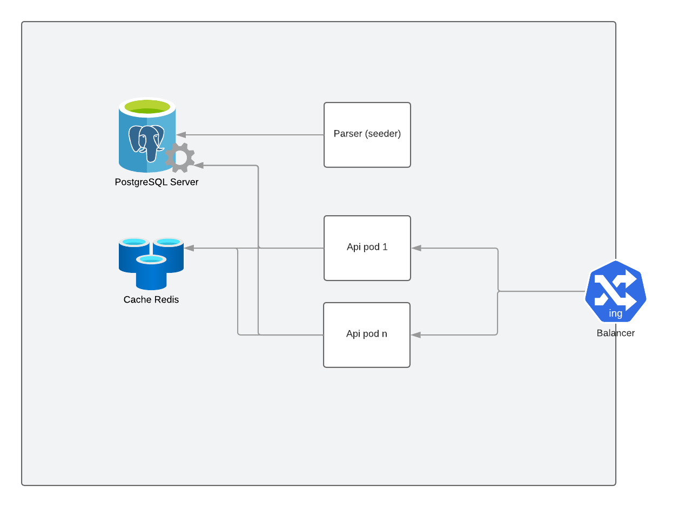

## Promotions

<!-- TABLE OF CONTENTS -->
<details>
  <summary>Table of Contents</summary>
  <ol>
    <li><a href="#requirements">Requirements</a></li>
    <li><a href="#installation">Installation</a></li>
    <li><a href="#environment">Environment</a></li>
    <li><a href="#structure">Main structure description</a></li>
    <li><a href="#usage">Usage</a></li>
  </ol>
</details>

## Technical problems from test task

1. The .csv file could be very big (billions of entries) - how would your application
perform? - *.csv file will not be loaded directly into memory, parser will read it line by line, and will insert by portions that can be configured in `env.json` (will be described after)
2. Every new file is immutable, that is, you should erase and write the whole storage; - file will be removed after parsing
3. How would your application perform in peak periods (millions of requests per
   minute)? - as you can see in `Structure and description` api gateway should work behind network balancer, we have possibility to scale and grow number of working api gateway, also we using `reddis` as a cache
4. How would you operate this app in production (e.g. deployment, scaling, monitoring)? - all aspects of working in production can be configured in `env.json` also scale via K8S or something like this. 

<!-- REQUIREMENTS -->
## Requirements
Needed to install and run:
* Docker
* Golang 1.17+

<!-- INSTALLATION -->
### Installation

In the project you can find the directory `shells/installs`. In this directory we
keep shells to pull and configure the needed dockers. Go to folder `shells/installs` then
run `sh ./install.sh` to pull and configure parts of system (postgres, redis).

<!-- ENVIRONMENT -->
## Environment
System can work in 2 modes.
1. `parser` - In this mode system will try to parse `promotions.csv` file each 30 minutes (possible to configure this option in `env.json`)
2. `api` - In this mode system will work as API Gateway

### Main structure description



Look at file `promotions.png`. System have 1 service as `parsers`, it's should be single pod/instance. Also we have api gateways, this parts is working under network balancer and can be terraformed as much as we need.
Look at file `env.json`

   ```json
{
  "mode": "api", // parser|api
  "token" : "123456",
  "prefix": "pr",
  "internal_mode": "local",
  "postgres": {
    "driver": "postgres",
    "host": "localhost",
    "port": "5432",
    "replica": "/?replicaSet=rs0&readPreference=secondaryPreferred&retryWrites=false",
    "name": "postgres",
    "user": "postgres",
    "password": "12345678"
  },
  "redis": {
    "driver": "redis",
    "host": "localhost",
    "port": "6379",
    "auto_connect": true,
    "user": "",
    "password": "",
    "name": 0,
    "expiration": 300 // cache ttl
  },
  "api": {
    "auto_connect": true,
    "host": "0.0.0.0",
    "port": "8090", // port for api
    "port_mapping": {
      "local": "8080",
      "push": "8081",
      "pull": "8082"
    }
  },
  "csv_parser": {
    "auto_start": true,
    "file_path": "Storage/promotions.csv", // file location to parse
    "inserts_count": 1000, // portions for each insert(in this case read 1000 rows 
    //from csv and insert ba making 1 query)
    "parsing_duration": 1800 // duration to check file existing and start seed again,
    //by default 30 minutes
  }
}
```

Actually the system look like little over-think system, but I think any system should be as much flexible as much it's possible.


### Usage
1. Install via install.sh in directory shells/installs/ (only once :) )
2. Run infrastructure via /shells/start.sh
3. in env.json set mode parser and run main.go (be sure that you have created table for promotions)
    ```sql
    create table promotions(
        id serial primary key ,
        id_hash text not null ,
        price float,
        expiration_date timestamp
    )
    ```
4. in env.json set mode api (api gateway will listen by default 0.0.0.0:8090)

PS. Because system is not stateless, in the system I have done grace shut-down 